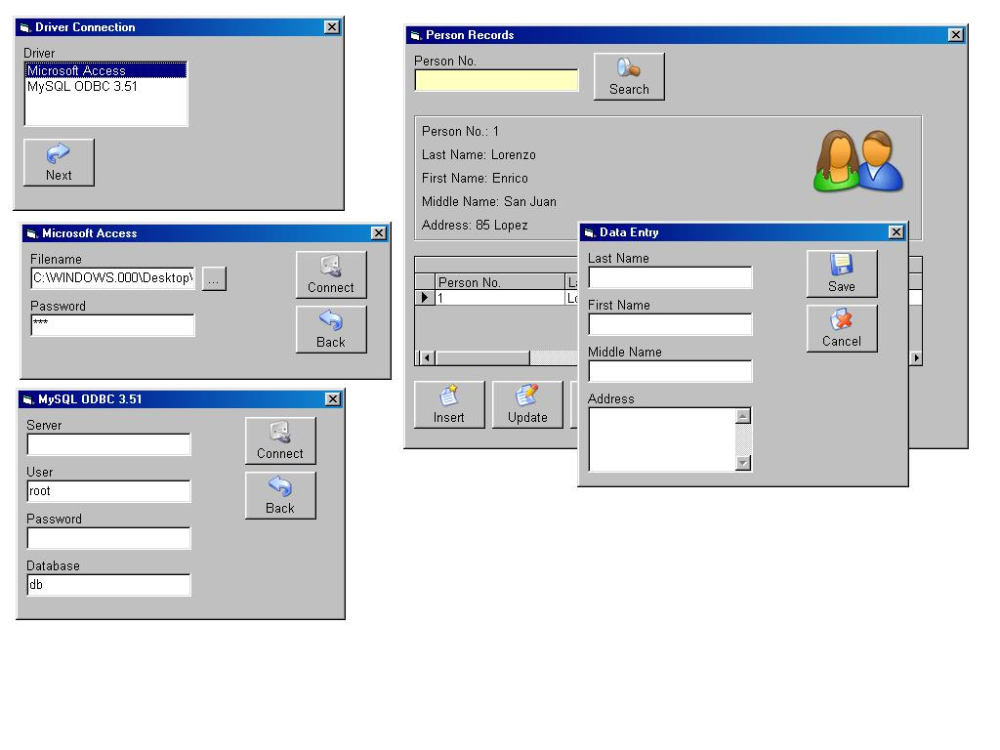



## DB APP that connects into multiple drivers: MS Access, and MySQL Server\.

### Description

A database application that allows you to connect into two drivers: MS Access, and MySQL Server. It has instructions on how to create the database in MySQL Server. Uses ADODB and SQL statements. Has nice GUI too.
 
### More Info
 

             |
---                |---
**Submitted On**   |2005-07-25 00:07:20
**By**             |[Enrico Lorenzo](https://github.com/Planet-Source-Code/PSCIndex/blob/master/ByAuthor/enrico-lorenzo.md)
**Level**          |Beginner
**User Rating**    |4.8 (24 globes from 5 users)
**Compatibility**  |VB 6\.0
**Category**       |[Databases/ Data Access/ DAO/ ADO](https://github.com/Planet-Source-Code/PSCIndex/blob/master/ByCategory/databases-data-access-dao-ado__1-6.md)
**World**          |[Visual Basic](https://github.com/Planet-Source-Code/PSCIndex/blob/master/ByWorld/visual-basic.md)
**Archive File**   |[DB\_APP\_to\_1917017242005\.zip](https://github.com/Planet-Source-Code/enrico-lorenzo-db-app-that-connects-into-multiple-drivers-ms-access-and-mysql-server__1-61887/archive/master.zip)

